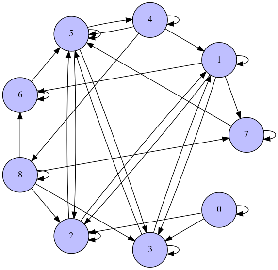
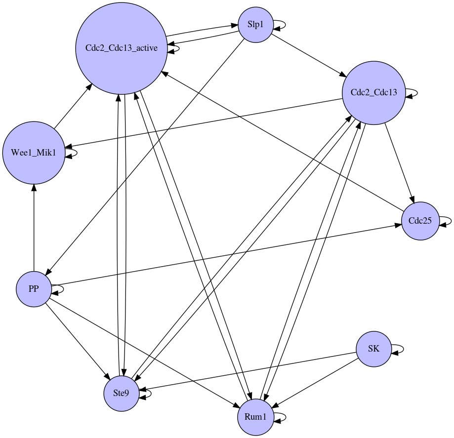

.. testsetup:: introduction

      from neet.boolean.examples import s_pombe

.. _networks:

Network Classes
===============

Neet provides a collect of pre-defined network types which are common models of complex systems,
including

.. autosummary::
   :nosignatures:

   neet.boolean.ECA
   neet.boolean.RewiredECA
   neet.boolean.WTNetwork
   neet.boolean.LogicNetwork

These concrete network types are leaves in a hierarchy:

.. inheritance-diagram:: neet.boolean.ECA neet.boolean.RewiredECA neet.boolean.WTNetwork neet.boolean.LogicNetwork
   :parts: 1

All networks in Neet ultimately derive from the :class:`neet.Network` class which provides a uniform
interface for all network models. This class provides a basic interface in and of itself, but
derives from :class:`neet.StateSpace` and :class:`neet.LandscapeMixin` to provide a wealth of
additional features. See :ref:`statespaces` and :ref:`landscapes` for more information.

Basic Network Attributes
^^^^^^^^^^^^^^^^^^^^^^^^

As an example, consider the boolean network :attr:`neet.boolean.examples.s_pombe`, which is a gene
regulatory network model of the cell cycle of *S. pombe* (fission yeast) [Davidich2008]_. All
networks have a "shape", namely an array of the number of states each node can take — it's base.

.. doctest:: introduction

     >>> s_pombe.shape
     [2, 2, 2, 2, 2, 2, 2, 2, 2]

In general, Neet's networks need not be uniform; each state can have a different base. However, all
of the networks currently implemented are Boolean, meaning that every node in the network has a
binary.

In addition to specifying the base of the nodes of the network, each node can be given a name.

.. doctest:: introduction

      >>> s_pombe.names
      ['SK', 'Cdc2_Cdc13', 'Ste9', 'Rum1', 'Slp1', 'Cdc2_Cdc13_active', 'Wee1_Mik1', 'Cdc25', 'PP']

Further, on the whole you can associate an arbitrary dictionary of metadata data, for example
citation information.

.. doctest:: introduction

      >>> s_pombe.metadata['citation']
      'M. I. Davidich and S. Bornholdt, "Boolean network model predicts cell cycle sequence of fission yeast," PLoS One, vol. 3, no. 2, p. e1672, Feb. 2008.doi:10.1371/journal.pone.0001672'

Dynamic State Update
^^^^^^^^^^^^^^^^^^^^

Beyond data such as these, concrete classes specify information necessary for describing the
dynamics of the network's state. Unlike most dynamical network packages, Neet's networks do not
store the state of the network internally. Instead, the API provides methods for operating on state
external to the network. In particular, :meth:`neet.Network.update` which updates a state of the
list or :class:`numpy.ndarray` **in place**.

.. doctest:: introduction

      >>> state = [0, 1, 1, 0, 1, 0, 0, 1, 0]
      >>> s_pombe.update(state)
      [0, 0, 0, 0, 0, 0, 0, 1, 1]
      >>> state
      [0, 0, 0, 0, 0, 0, 0, 1, 1]

This single function allows Neet to implement a number of common analyses such as :ref:`landscape
<landscapes>`, :ref:`information <information>` and :ref:`sensitivity <sensitivity>` analyses.

Graph Structure
^^^^^^^^^^^^^^^

As dynamical networks, all :class:`neet.Network` instances have a `directed graph
<https://en.wikipedia.org/wiki/Directed_graph>`_ structure. Neet provides a minimal interface for
exploring this structure. At it's basic, you can probe which nodes are connected by an edge:

.. doctest:: introduction

      # source nodes of edges incoming to node 6
      >>> s_pombe.neighbors(6, direction='in') == {1, 6, 8}
      True

      # target nodes of edges outgoing from 6
      >>> s_pombe.neighbors(6, direction='out') == {5, 6}
      True

      # all nodes connected to node 6
      >>> s_pombe.neighbors(6, direction='both') == {1, 5, 6, 8}
      True

      # all nodes connected to node 6
      >>> s_pombe.neighbors(6, direction='both') == {1, 5, 6, 8}
      True

Of course, this will only get you so far. Luckily, the `NetworkX <https://networkx.github.io/>`_
package provides a whole host of graph-theoretic analyses. To take advantage of that fact, and not
avoid Neet reinventing the wheel, you can export your Neet network as a :class:`networkx.DiGraph`.

.. doctest:: introduction

      >>> import networkx as nx
      >>> g = s_pombe.network_graph()
      >>> nx.shortest_path(g, 1, 5)
      [1, 2, 5]
      >>> g = s_pombe.network_graph(labels='names')  # default labels='indices'
      >>> nx.shortest_path(g, 'Cdc2_Cdc13', 'Cdc2_Cdc13_active')
      ['Cdc2_Cdc13', 'Ste9', 'Cdc2_Cdc13_active']

You can draw the graphs, with the nodes labeled by either the node index

.. doctest:: introduction

      >>> s_pombe.draw_network_graph({'labels': 'indices'}, {
      ...    'path': 'source/static/s_pombe_indices.png',
      ...    'display_image': False
      ... })

or labeled by the node name:

.. doctest:: introduction

      >>> s_pombe.draw_network_graph({'labels': 'names'}, {
      ...    'path': 'source/static/s_pombe_names.png',
      ...    'display_image': False
      ... })

